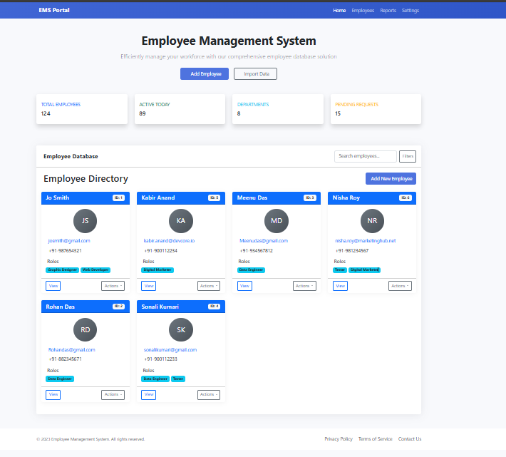

# 🧑‍💼 Employee Management System

A **web-based Employee Management System** built using the **Django** framework. This system helps organizations manage employee records effortlessly with an intuitive, responsive interface.

## 🌐 Live URL
[http://127.0.0.1:8000/](http://127.0.0.1:8000/)  
*(For local use — update with deployed link if applicable)*

---

## 🚀 Features
- ➕ **Add New Employees:** Quickly register new employees with detailed information.
- 📝 **Edit/Update Records:** Modify employee details as needed.
- ❌ **Delete Records:** Easily remove employee entries.
- 🔍 **Search & Filter:** Locate employees efficiently using search and filter options.
- 📋 **View Employee List:** See all employees along with their assigned roles in a well-structured table.
- ✅ **User-Friendly Interface:** Clean, responsive design for seamless use across devices.

---

## 🛠️ Tech Stack
- **Backend:** Django (Python)
- **Frontend:** HTML, CSS, Bootstrap
- **Database:** SQLite (default, easily configurable to PostgreSQL/MySQL)
- **Tools:** Django Admin, Django ORM, Django Template Language

---

## 📦 Setup Instructions

### 1. Clone the Repository
```bash
git clone https://github.com/sonali6062/Employee-Management-System.git
cd Employee-Management-System
````

### 2. Create a Virtual Environment

```bash
python -m venv venv
source venv/bin/activate  # For Linux/Mac
venv\Scripts\activate     # For Windows
```

### 3. Install Dependencies

```bash
pip install -r requirements.txt
```

### 4. Apply Migrations

```bash
python manage.py migrate
```

### 5. Run the Server

```bash
python manage.py runserver
```

### 6. Access the Application

Open your browser and go to: [http://127.0.0.1:8000/](http://127.0.0.1:8000/)

---

## 🔐 Admin Login

* Navigate to: [http://127.0.0.1:8000/admin](http://127.0.0.1:8000/admin)
* Create a superuser:

```bash
python manage.py createsuperuser
```

* Use the credentials to log in and manage the system via Django Admin.

---

## 📸 Screenshots

<p align="center">
  
</p>

<p align="center">
  
</p>

<p align="center">
  
</p>

---

## 🤝 Contributing

Feel free to fork this repository, make changes, and submit pull requests. Contributions are always welcome!

---


